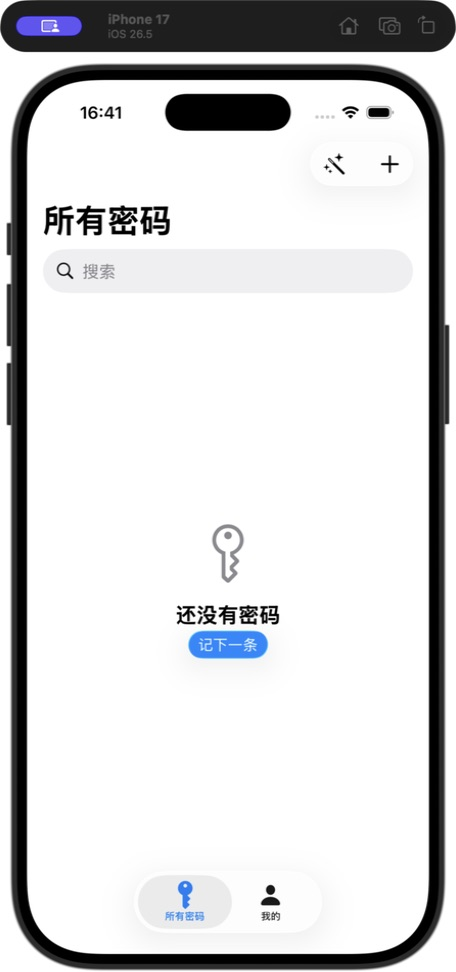
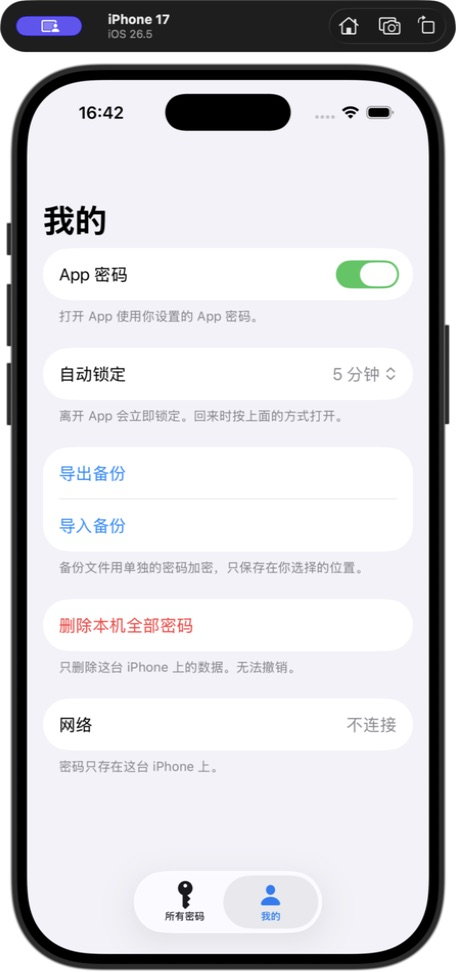

# Offline Vault

[English](README.md) · [中文](README.zh-CN.md)

只存在这台 iPhone 上的原生密码本。不联网，没有账号，也没有云。

面容 ID 和 App 密码可以同时开。面容 ID 是快开，App 密码是后路。

## 这是什么

Offline Vault 把登录信息存在本机。底部两个入口：

- **所有密码** — 按一级 / 二级分组查找、查看、复制、编辑、记下
- **我的** — 选择怎么打开 App、导出备份、清空本机数据

敏感字段用 AES-256-GCM 加密后写入 SwiftData。数据密钥不会离开这台设备。面容 ID 从钥匙串取出密钥；App 密码在本地解开同一把密钥。

## 明确不做

- 账号 / 登录
- 云同步 / iCloud
- 任何网络请求或分析
- 密码分享（只支持通过加密备份换机）
- 浏览器自动填充扩展（第一版）

## 功能

- 两个 Tab：所有密码、我的
- 面容 ID 和 App 密码可同时开启
- 第一次使用先设 App 密码，再选择是否开面容 ID
- 按选择的时长自动锁定，切回 App 时检查是否超时
- 搜索名称、账号、网址、备注和两级分组
- 详情页支持揭开、复制和编辑密码
- 支持一级 / 二级分组，例如 `ECS / AppStore`
- 新建时可以快速换一条密码
- 复杂密码生成器：自动生成、快捷复制、保存
- 复制后的密码 30 秒后从剪贴板清除，且不走万能剪贴板
- 加密导出 / 导入 `.vault` 备份，支持通过隔空投送或文件换机
- 系统原生界面；iOS 26 的工具栏、Tab 和主按钮使用 Liquid Glass

## 截图

下面的截图来自当前 `main` 版本，在 iOS 26.5 的 iPhone 17 模拟器中运行。

| 所有密码 | 我的 |
| --- | --- |
|  |  |

## 安全设计

| 项目 | 实现 |
| --- | --- |
| App 密码 | 用 Argon2id 包装数据密钥，不以明文保存 |
| 面容 ID | LocalAuthentication + Keychain（`userPresence`，仅本机） |
| 加密 | CryptoKit AES-256-GCM，加密密码字段 |
| 会话 | 解开后的密钥只留在内存，锁定后清除 |
| 文件保护 | `NSFileProtectionComplete`，数据目录排除 iCloud 备份 |
| 剪贴板 | 30 秒过期，`localOnly` |

两个锁都关掉后，打开 App 不再验证。建议至少保留一种。换机时请在旧机导出加密备份，通过隔空投送或文件发送到新机后导入；本 App 不做云同步，也不会自动联网迁移。

## 系统要求

- Xcode 16+（推荐 Xcode 26，以便编译 Liquid Glass）
- iOS 17.0+
- Swift 5，SwiftUI + SwiftData
- 真机才能完整测试 Face ID / Touch ID

## 本地运行

1. 用 Xcode 打开 `OfflineVault.xcodeproj`
2. 在 Signing & Capabilities 里选择你的 Development Team
3. 选模拟器或真机运行

模拟器请先打开 **Features → Face ID → Enrolled**。

模拟器忘记 App 密码时，可以在锁屏页选择 **忘记密码，直接进入模拟器**。首次使用会清空当前模拟器的本地密码数据并保存开发密钥，之后模拟器启动不再要求输入密码；该入口只编译到 Simulator，真机不会显示。

```bash
xcodebuild -project OfflineVault.xcodeproj -scheme OfflineVault \
  -destination 'platform=iOS Simulator,name=iPhone 17' \
  CODE_SIGNING_ALLOWED=NO test
```

## 项目结构

```
OfflineVault/
├── App/                 入口、根视图、Tab
├── Core/
│   ├── Crypto/          Argon2id / PBKDF2、AES-GCM、安全内存
│   ├── Auth/            App 密码、面容 ID、自动锁定
│   ├── Vault/           SwiftData 与加解密封装
│   └── Backup/          .vault 导入导出
├── Features/            锁定、列表、详情、编辑、生成器、我的
├── Shared/              原生玻璃、剪贴板
└── Vendor/argon2/       官方 PHC Argon2 源码（本地编译）
```

## 备份格式

导出文件扩展名为 `.vault`。用单独的备份密码派生密钥，再对整包 JSON 做 AES-GCM 加密。导入按条目 ID 合并，已存在的会被覆盖。这个密码只保护备份文件，不是打开 App 用的。

## 许可证

本项目使用 [MIT License](LICENSE)。

内置的 Argon2 参考实现来自 [PHC winner Argon2](https://github.com/P-H-C/phc-winner-argon2)，采用 CC0 1.0 / Apache 2.0。
